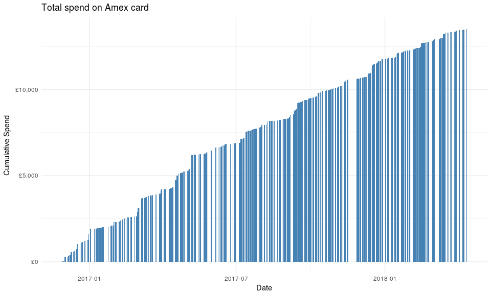

# Amex Scraper

A small library to scrape data from the Amex GUI, to take care of your
finances.

## Usage

Start the Selenium driver. Remove the `extraCapabilities` argument to
run Chrome without headless mode, and watch it go\!

``` r
options = list(chromeOptions = list(
  args = c('--headless', '--disable-gpu', '--window-size=1280,800')
))

driver = RSelenium::rsDriver(browser = "chrome", verbose = FALSE, extraCapabilities = options)
```

Go directly to the transactions page URL to be blocked by the login
screen.

``` r
URL = 'https://global.americanexpress.com/myca/intl/istatement/emea/v1/statement.do?Face=en_GB&method=displayStatement&sorted_index=0&BPIndex=0#/'

client = driver$client
client$navigate(URL)
```

Hide your credentials in your system environment when logging in. In
bash, placing a space before typing in a command will ensure your
password is not saved in your history. Your credentials will of course
be available through your envrionment variables
though.

``` r
scrapers::login(client, Sys.getenv('AMEXUSERNAME'), Sys.getenv('AMEXPASSWORD'))
```

Manipulate the date picker widget to pick all days you could have made
transactions. I started using my card on `2016-11-16`. Helpfully, Amex
greys out days before the first transaction so it’s obvious to you (and
so it could be automated, but it’s more effort than it’s worth).

``` r
scrapers::select_all(client, "2016-11-16")
```

Click “Show More Transactions” to load the entire list.

``` r
scrapers::load_all(client)
```

Get the table in a usable form using `rvest` and `xml2`. Plot a graph\!

``` r
scrappers::get_transaction_table(client) %>%
  tibble::as_tibble() %>% 
  separate(Amount, into = c("junk", "amount"), sep = " ") %>%
  mutate(amount = stringr::str_replace_all(amount, "[£ ,]", "") %>% as.numeric()) %>%
  mutate(Date = Date %>% as.Date(format = "%d %b %y")) -> tbl
```

``` r
ggplot(tbl %>% 
         filter(amount > 0) %>% 
         arrange(Date) %>% 
         mutate(cumulative = cumsum(amount)
  )) +
  geom_bar(
    aes(x = Date, y = cumulative, group = Description),
    position = "identity", stat = "identity", fill = "steelblue",
  ) +
  theme_minimal() +
  labs(
    title = "Total spend on Amex card",
    x = "Date", 
    y = "Cumulative Spend"
  ) +
  scale_y_continuous(labels = scales::dollar_format(prefix = "£"))
```


